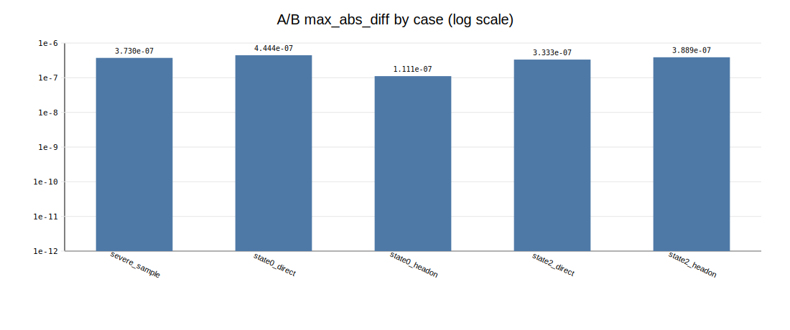
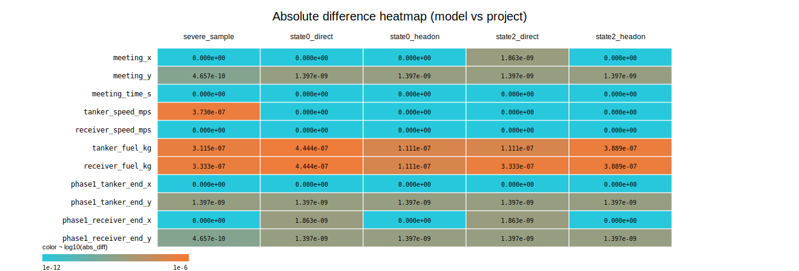
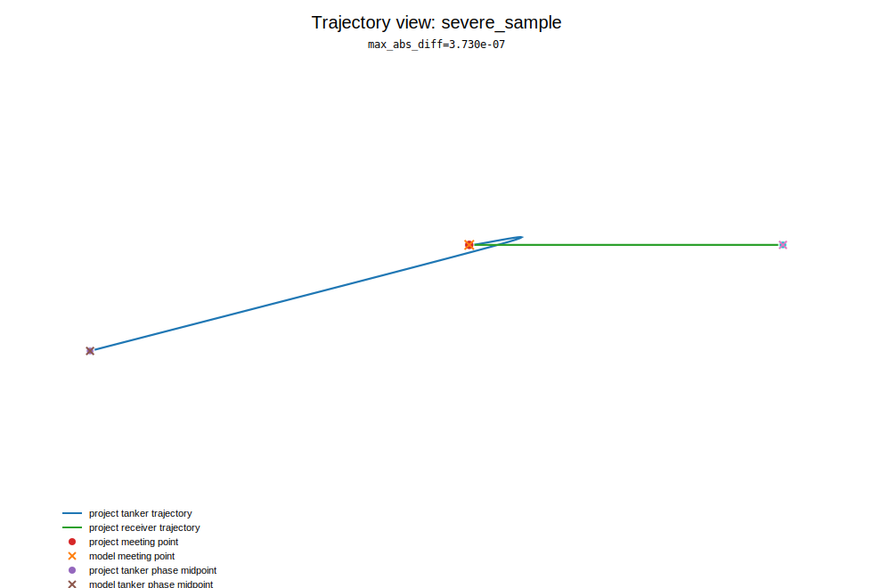
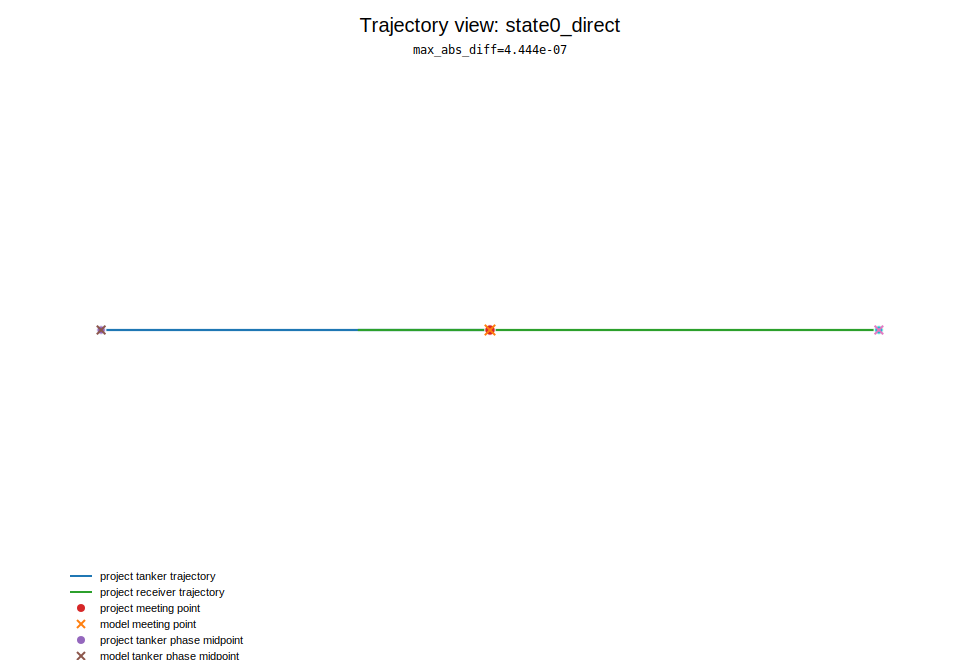
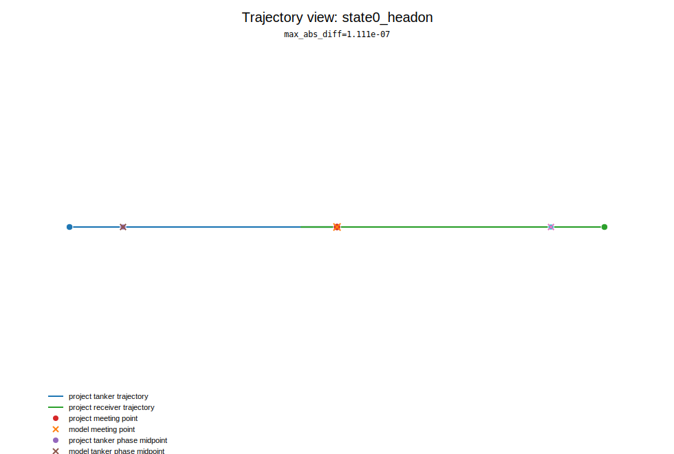
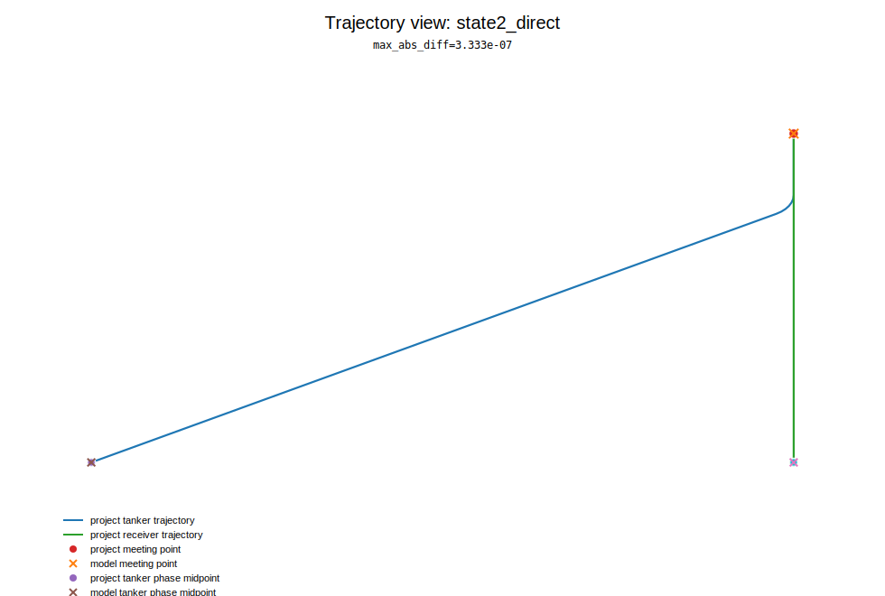
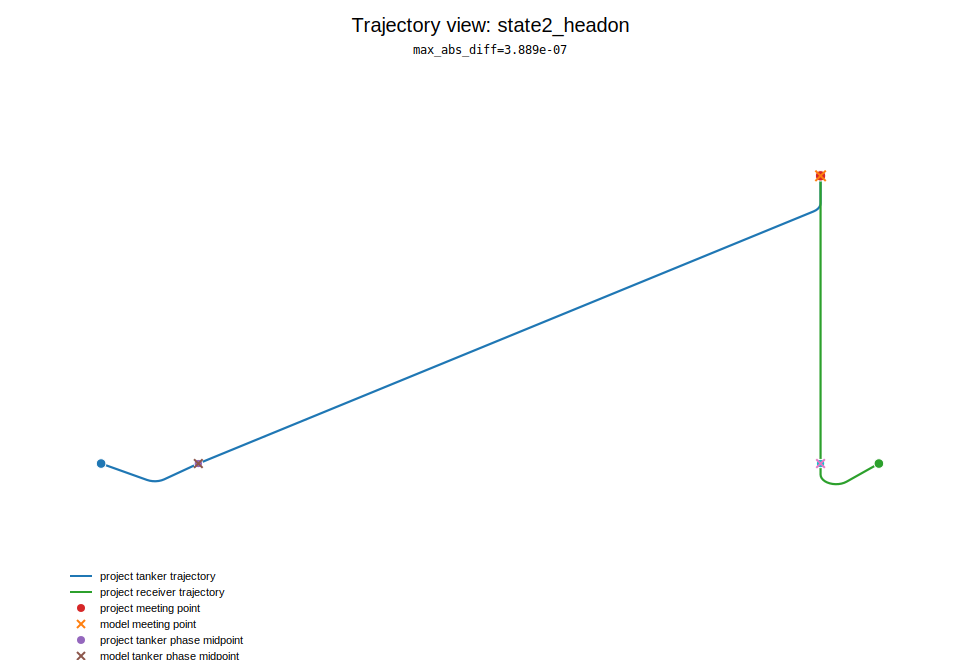

# A/B Visualization Summary

- Source: `ab_report.json`
- Cases: 5

## Overview

## Case table

| case | method(model/project) | method_match | max_abs_diff |
|---|---|---:|---:|
| severe_sample | B/B | true | 3.730e-07 |
| state0_direct | A/A | true | 4.444e-07 |
| state0_headon | A/A | true | 1.111e-07 |
| state2_direct | B/B | true | 3.333e-07 |
| state2_headon | B/B | true | 3.889e-07 |

## Trajectory visualizations

### severe_sample

### state0_direct

### state0_headon

### state2_direct

### state2_headon

