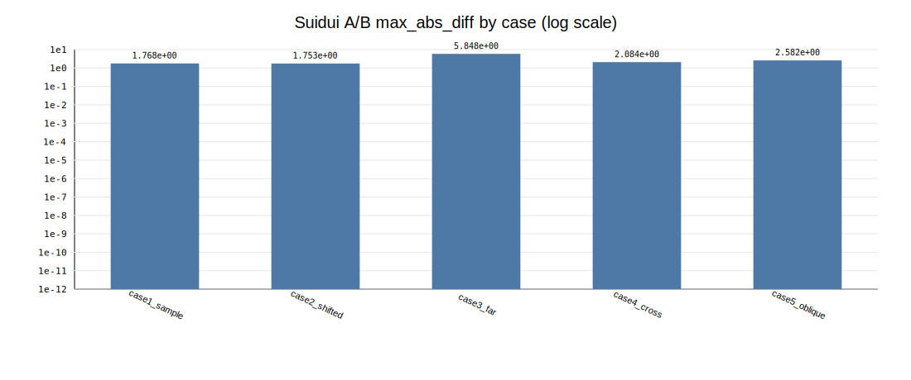
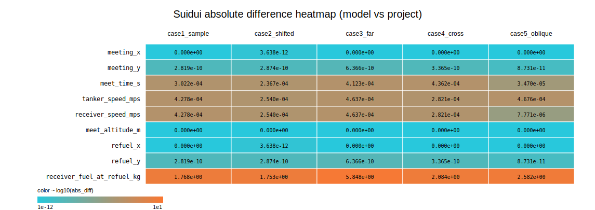
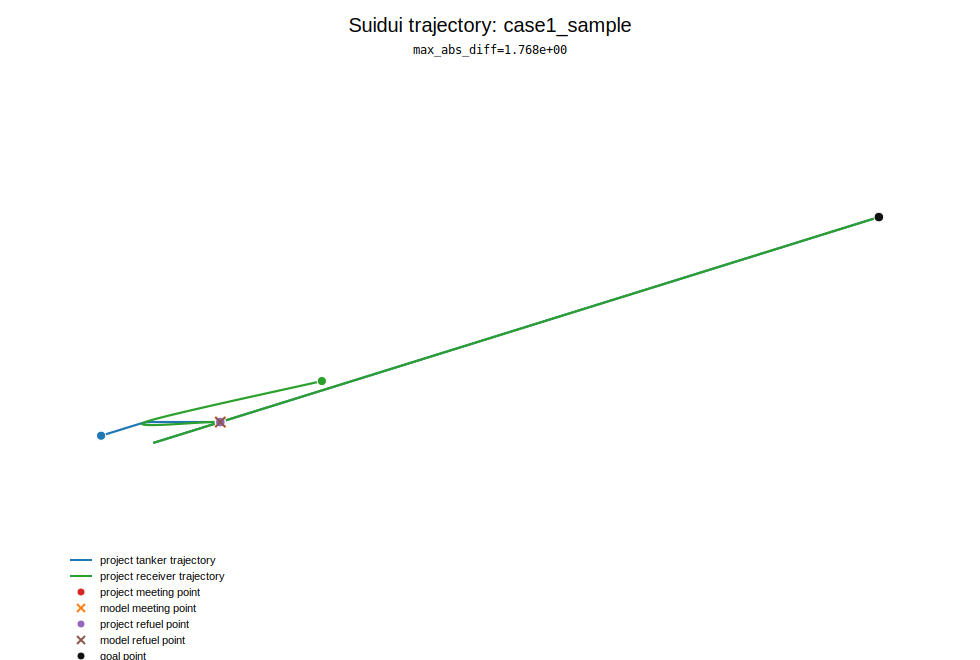
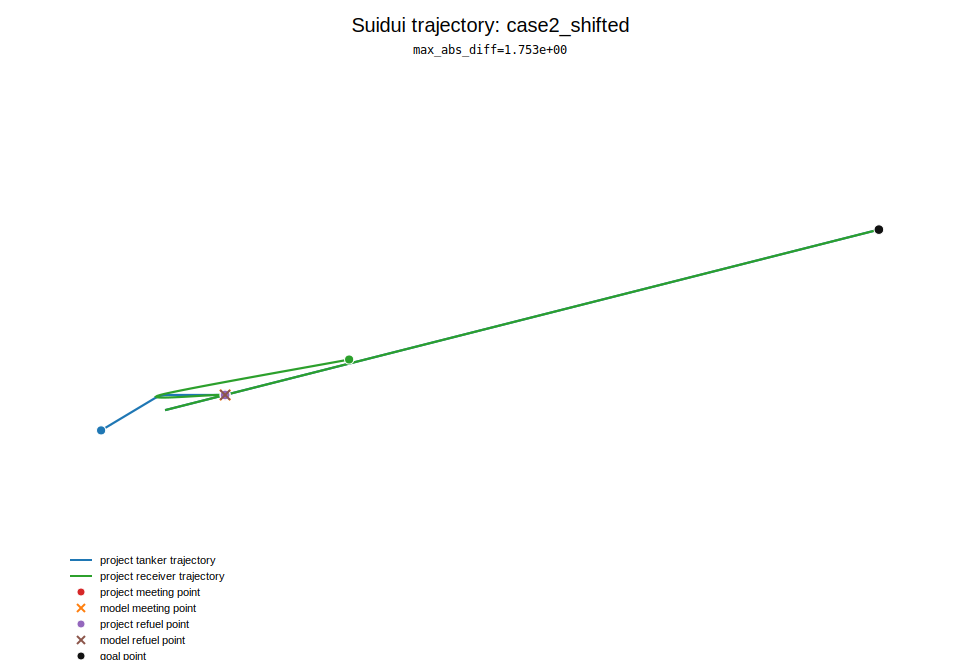
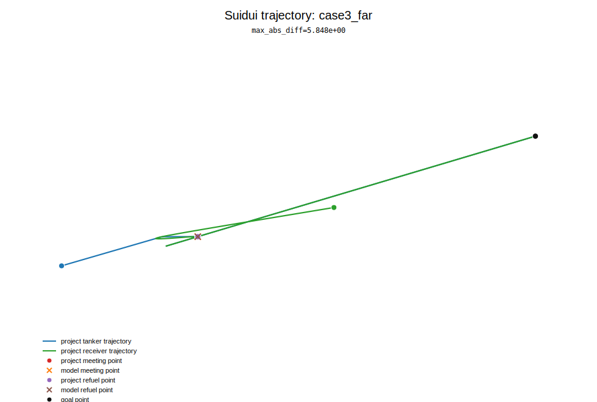
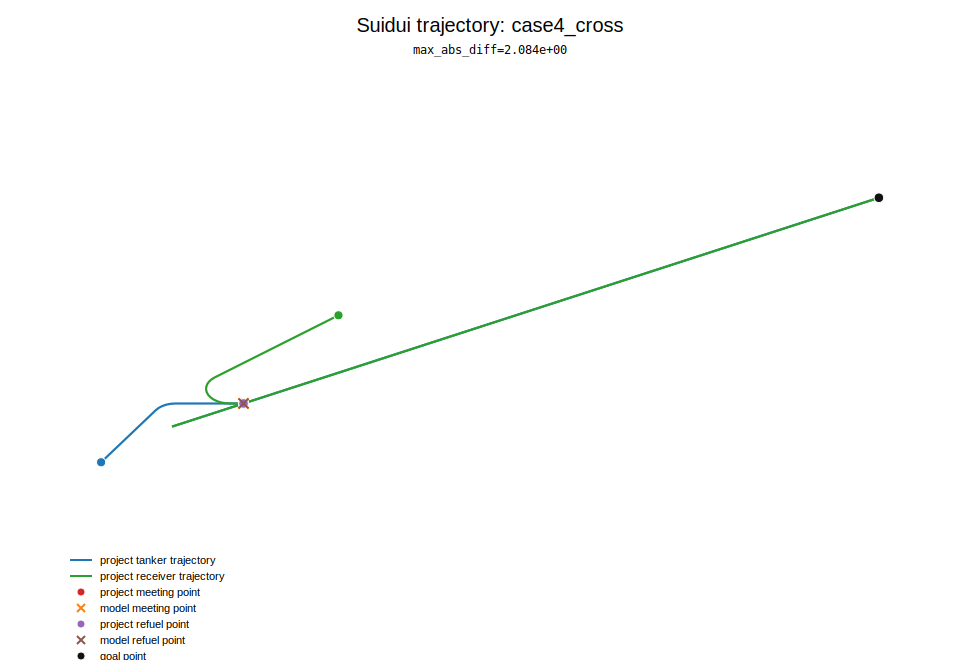
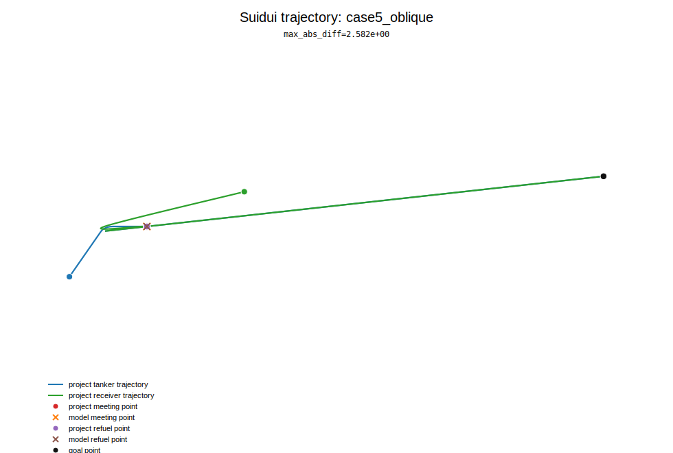

# Suidui A/B Visualization Summary

- Source: `ab_report.json`
- Cases: 5

## Overview

## Case table

| case | max_abs_diff |
|---|---:|
| case1_sample | 1.768e+00 |
| case2_shifted | 1.753e+00 |
| case3_far | 5.848e+00 |
| case4_cross | 2.084e+00 |
| case5_oblique | 2.582e+00 |

## Trajectory visualizations

### case1_sample

### case2_shifted

### case3_far

### case4_cross

### case5_oblique

